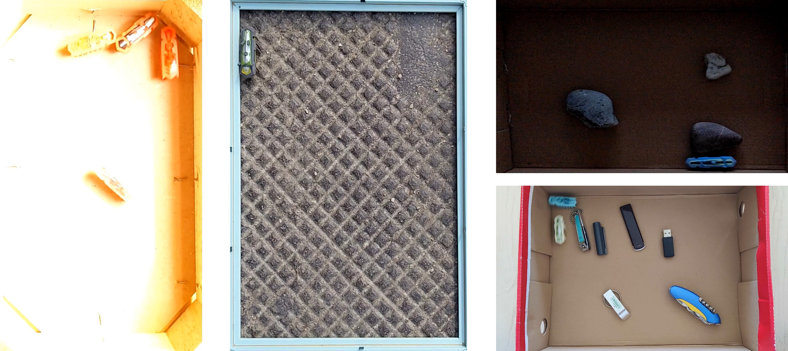
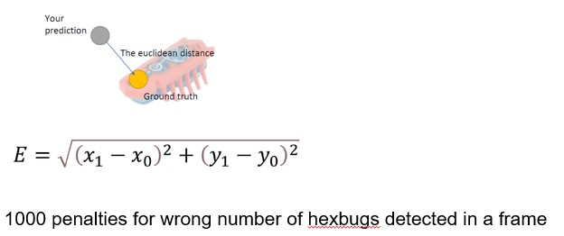
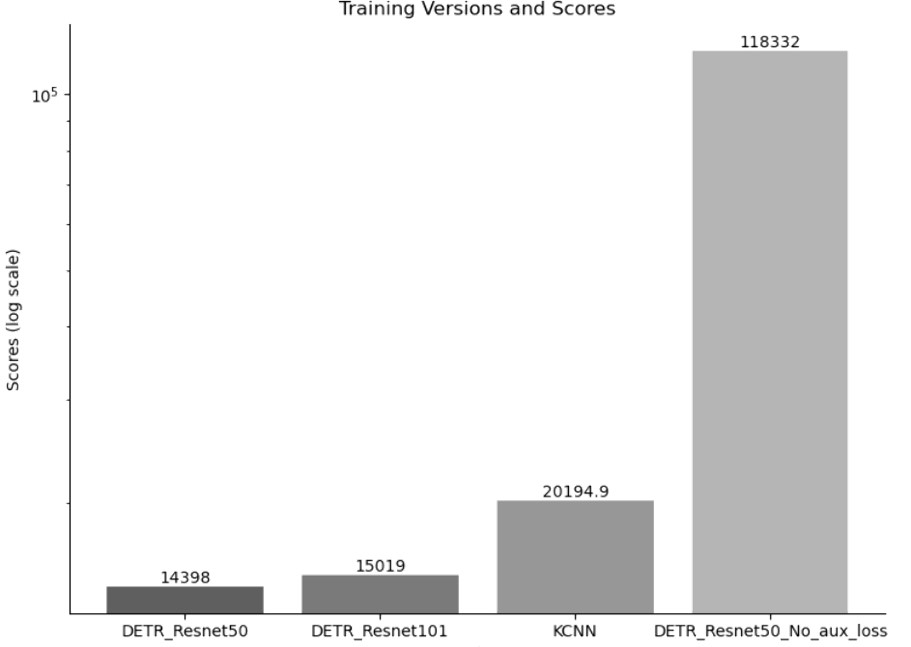
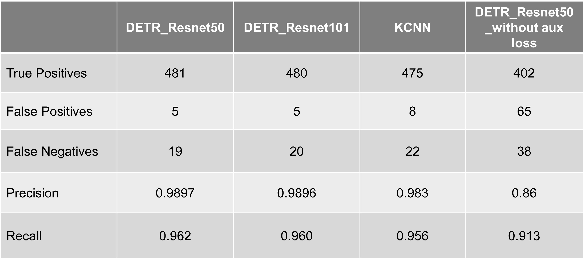

# About the Project
Computer vision is one of the major tasks and applications of artificial intelligence (AI). Gaining hands-on experience is therefore of great importance for future AI developers. 

In the Tracking Olympiad Project : Summer Semester 2023 at FAU Erlangen, Germany, students use the latest object detection and tracking algorithms to track a freely, randomly moving object ("HexBug") in a given arena. 

A set of videos are provided that contain the ground-truth positional information and we will implement an own tracking technique. 

# Problem Statement
- **Build an AI agent to track heads of hexbugs**.
- **Starting Point**: 100 videos and annotations were provided.
- **Performance**: The agent should generalize well even in very complex environments.

- **Scores or Evaluation Metric**

# Methodology
- **Used Detection Transformer (DETR) with different backbones**
- **Used regression head to regress the x,y coordinates of head of hexbugs**
- **ResNet 152 Dilated Convolutional backbone performs best**
- **Data Preprocessing includes :**
  - Normalization
  - Data Augmentation
  - Color Jitter
  - Gaussian blur filter
  - Random Rotation
  - Random Invert

- **HyperParameter Tunning and Training**
  - **4 Nvidia A100 GPU (40 GB each)** on Alex HPC cluster (total batch size kept as `56`)
  - **Coefficients for loss function**:
    -   Total loss = `10 * bbox_loss + 2 * ce_loss + 2 * loss_giou + 10 * reg_loss`

  - **Use of auxiliary cross entropy losses in each of the decoder layer**: Set to `True`
  - **Coefficients for cost in Hungarian algorithm assignment**
  - **Coefficient in the CE loss for class imbalance** due to more queries in the decoder
  - **Learning rate** for backbone `0.00001`, and Lr for transformer heads `0.0001`
  - **Early stopping, model checkpoint saving and tensorboard logging**

- **Post Processing**
  - **Sorting / Associative algorithm**:
    -   The algorithm associates the current frame detections with previous frames
    -   In case of missing detections, it starts a new tracking
    -   In case of extra detections, it eliminates wrong tracking
   
- **Further comparisons**
  - **Sorting / Associative algorithm**:
    -  Experimented with K-RCNN (Key point RCNN)
    -  Documented and compared with DETR Transformer based approach

# Results and Experiments
  -  Achieved second position overall, https://traco.anki.xyz/leaderboard.php
  -  Scores with different experiments (test data), lower the better.
    
    
    

# Code
  - **Sorting / Associative algorithm**:

# Full Report 
  - **[View the PDF](Towards_Seamless_Hex-Bug_Tracking_Salil_Bhatnagar_23220858.pdf)**
    
# Code
- **train.py**:
  - The script initializes a PyTorch Lightning training pipeline for a DETR model, processes the COCO dataset for object detection, and manages training with custom data loaders, early stopping, and checkpointing.
  - It uses a pre-trained image processor and conducts training with GPU acceleration, logging results via TensorBoard. Upon execution, the model is trained, validated, and saved automatically.
 
- **post_process.py**:
  - The script defines functions to generate initial and final predictions of object locations in video frames using an object detection model, applying a threshold to filter predictions.
  - It calculates initial predictions per frame, adjusts them using an associative algorithm to maintain consistency across frames, and handles cases with fewer detections than expected by backtracking to match with previous frames' data. 
  
- **visualize.py**:
  - The script loads the model from a checkpoint and evaluates the test dataset, with results plotted and saved using Matplotlib.

- **final_inference.py**:
  - The script loads the model from a checkpoint and evaluates the test dataset, with results plotted and saved using Matplotlib.

